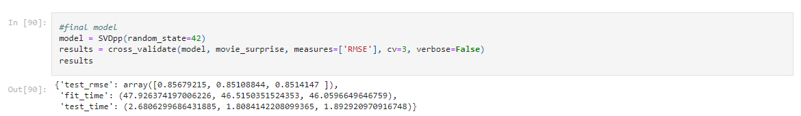

# Developing a Movie Recommendation System for Paramount +


The team at Prophetic Insights analyzed over 600 users with over 100,000 reviews for movies ranging in years from 1902 to 2018 to find useful information in developing a recommendation system for Paramount +. With our analysis and modeling, our stakeholder Paramount + can use our data driven insights to help create a better recommendation system for their streaming service.

## Business Objective
With how much competition there is in the entertainment streaming industry, it is more imperative than ever that businesses are able to retain their user-base. Streaming services are held to the mercy of creating popular content in order to have new users sign up and to retain current users, which causes an arms race of content creation between the already crowded market. One way to cut costs in order to compete in this arms race is to reduce the customer churn experienced during those lulls in content creation. The team at Prophetic Insights goal is to find data driven insights to help create a better recommendation system for Paramount +.

## Main Findings
In the teams analysis of the 100,000+ reviews, we derived three main recommendations/insights for Paramount + to keep in mind for their recommendation system:

- Item-based collaborative filtering outperforms user-based filtering.

- “Cold Start” solution.

- Focus I.P acquisitions on top 5 genres

Our final item-based recommendation system was accurate to .86 (RMSE) of the users actual score. This means if the user gave a movie a 3.5, we would’ve predicted their score to be within the range of 2.64 - 4.36.

## The Notebooks
The technical lead operated out of the Juana branch, while technical associates assisted through pair programming and their own branches. The main files for this project are in movie_recc_system.ipynb

## Data Cleaning
The dataset includes 4 csv files inside of the ml-latest-small folder. The 4 datasets inside of this folder are:

Links.csv, movies.csv, ratings.csv, tags.csv

These datasets included features such as userId, movieId, tag, timestamp, title, rating, genres. Movie year is a feature created from information inside of the title feature. After data cleaning and merging the csv files, the team went into some exploratory data analysis.

## EDA


 


 


 

 
## Recommendation System Modeling
For our recommendation system modeling we tried both with super users (top 5 users with the most reviews) and without super users. We ended up going with a recommendation system without super users even though we received worse results due to the high impact super users had on everyone's recommendations.
 

 

 
 
## Cold Start Problem
 
One issue we tried to solve was the problem of new users and them having recommendations. Our solution to this was to have them input 10+ reviews for movies based on the genres they enjoyed.

```movieId          title                  genres

28386     1265  Groundhog Day  Comedy|Fantasy|Romance

How do you rate this movie on a scale of 1-5, press n if you have not seen :

5```
 
After entering their reviews, we could then present them a list of movies our recommendation system thought they would enjoy.
 
- Recommendation #  1 :  277    Shawshank Redemption, The (1994)

- Recommendation #  2 :  2582    Guess Who's Coming to Dinner (1967)

- Recommendation #  3 :  4025    Grave of the Fireflies (Hotaru no haka) (1988) 

- Recommendation #  4 :  704    Sunset Blvd. (a.k.a. Sunset Boulevard) (1950)

- Recommendation #  5 :  937    Seventh Seal, The (Sjunde inseglet, Det) (1957)

- Recommendation #  6 :  2963    Legend of Drunken Master, The (Jui kuen II)

## Recommendations and conclusions for Paramount +
Overall, we recommend that Paramount + focus their efforts on developing a SVD++ model, with having new users enter their personal ratings for 10+ movies, and to focus their I.P acquisitions on the top 5 genres that users interact with the most. 

## Future Investigations
This section goes into a few things we thought were interesting, but unfortunately didn’t have the time to develop or investigate further.

- Creating a user review rewards system that would promote users who don’t review to start reviewing. This could help with getting more non-super user reviewers.

- Developing a plan for popular content acquisition or creation to further reduce customer churn.

- Minimizing any overrepresentations in the recommendation system. The dataset we used did not have any demographic breakdown, so there could be potential for hidden biases in our recommendation system.

- Building a recommendation system exclusively for Paramount’s intellectual properties.
 
## For More Information
Please review our full analysis in our [our Jupyter Notebook](./movie_recc_system.ipynb) or our [presentation](./presentation.pdf).
 
For any additional questions, please contact **Juana Tavera | tvrjuana@gmail.com, Brendan Bruno | btbruno20@gmail.com, Mackoy Staloch | mackoy.staloch@gmail.com**
 
## Repository Structure
```
├── README.md                          <- The top-level README for reviewers of this project
├── movie_recc_system.ipynb            <- Narrative documentation of analysis in Jupyter notebook
├── presentation.pdf                   <- PDF version of project presentation
├── data                               <- Both sourced externally and generated from code
└── images                             <- Both sourced externally and generated from code
